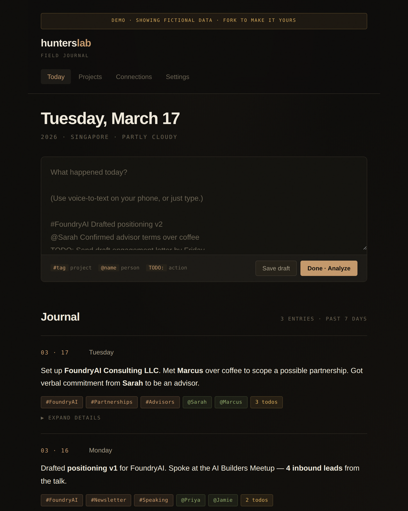
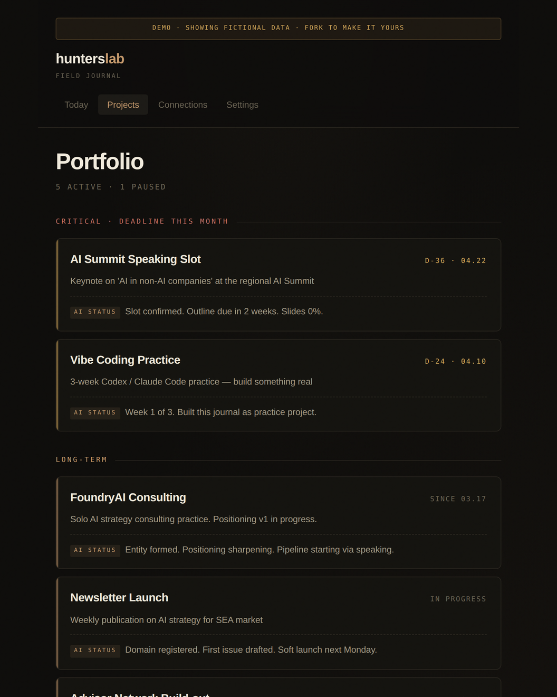
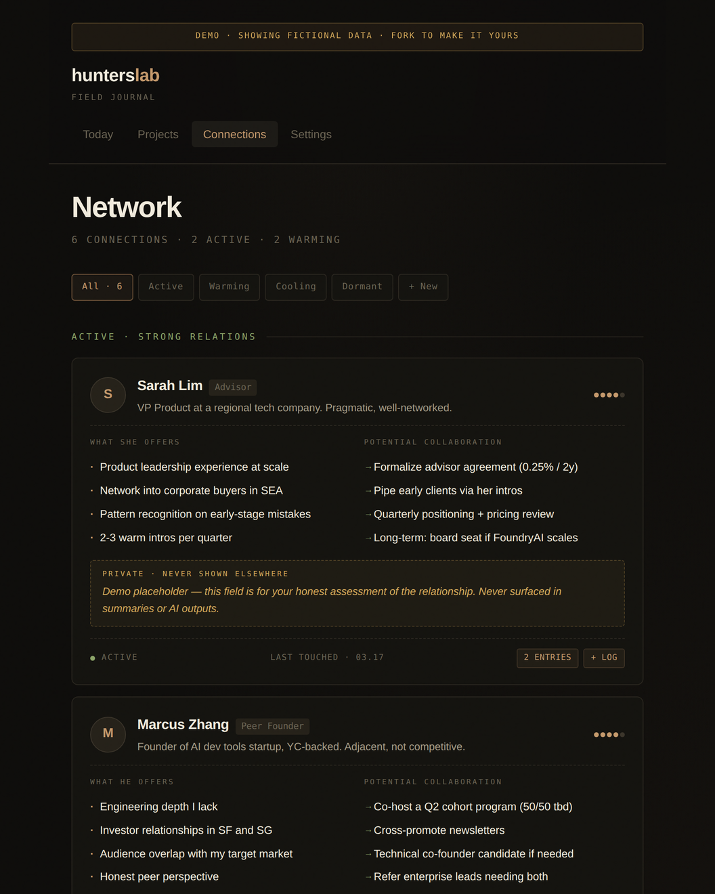

# hunterslab · field journal

> A solo founder's thinking journal — voice-first, AI-augmented, deeply personal.


This is not a to-do app. It is a thinking tool for one person.

It records what happened, who you talked to, what you decided, and what you noticed — then quietly lets AI surface patterns you would have missed.

[**View the live demo →**](https://your-username.github.io/hunterslab-field-journal/)

---

## Why this exists

Most productivity tools are built for teams. They assume you need to share, collaborate, and report up. But solo founders, operators, and independent professionals have a different problem: **too much context lives in their head, and there is no good place to put it.**

Notion is too heavy. Day One is too narrative. Todoist is too transactional. None of them help you see the pattern that "the deal you walked away from last week is the same dynamic playing out with a different person this week."

Field Journal is built around three convictions:

1. **Raw is sacred.** Whatever you said or typed — verbatim — is preserved forever. AI summaries are a re-renderable view on top of it, not a replacement.
2. **People are projects.** Your relationships have stages, resources, and possible collaborations. They deserve the same structured attention as your products.
3. **Friction kills journaling.** If it takes more than 60 seconds to record something, you won't do it. The default input is voice (or voice-to-text), one paragraph, hit save.

---

## What it looks like

The app has four tabs:

### `Today` · the daily record
Voice or text input. AI auto-detects projects, people, and todos via `#tag`, `@mention`, and `TODO:` syntax. Each entry has a summary on the surface and expandable structured details underneath.

### `Projects` · the portfolio view
Auto-aggregated from your entries. Sorted into critical (deadline this month), long-term, and paused. Each card shows an AI-generated status summary refreshed daily.

### `Connections` · the relationship CRM
Every person you mention becomes a tracked relationship. Fields include role, resources they bring, potential collaborations, relationship strength (1-5), and a **private note field that is never surfaced in any AI output**.

### `Settings` · cloud sync, AI keys, data export
All data is yours. Bring your own Supabase project (free tier works). Bring your own Claude API key. Export as JSON anytime.

---

## Screenshots

> Add your own screenshots to `/screenshots/` after forking. The mockup ships with fictional demo data (the persona is "Alex Chen", a solo AI consultant in Singapore).

| Today | Projects | Connections |
|---|---|---|
|  |  |  |

---

## Quick start

This is currently a **static HTML mockup** — no backend, no build step, no dependencies. Just open `index.html` in a browser.

```bash
git clone https://github.com/your-username/hunterslab-field-journal.git
cd hunterslab-field-journal
open index.html  # or just double-click it
```

To deploy as a GitHub Pages site:

1. Go to **Settings → Pages**
2. Source: **Deploy from a branch → main → / (root)**
3. Wait 1 minute, visit `https://your-username.github.io/hunterslab-field-journal/`

---

## Roadmap

- [x] **v0.1 — Static mockup** — All four tabs, design language locked, fictional demo data
- [ ] **v0.2 — Local persistence** — IndexedDB, voice-to-text input via Web Speech API
- [ ] **v0.3 — Cloud sync** — Supabase backend, multi-device, audio storage
- [ ] **v0.4 — AI insights** — Claude API integration for summary, project status, connection patterns
- [ ] **v0.5 — Mobile PWA** — Installable to home screen, offline-first
- [ ] **v1.0 — Public release** — Polish, docs, demo deployment

---

## Design philosophy

> "We don't need a bigger funnel. We need a sharper filter."

Field Journal makes specific design choices:

- **Dark by default.** Built for working at night, for thinking when the world is quiet.
- **Editorial restraint.** No emojis as UI. No gradients. No purple. The color palette is two: warm copper and warm grays. Inspired more by field intelligence reports than by SaaS dashboards.
- **The raw audio is the source of truth.** AI summaries are renders. Anyone reading their journal a year later should be able to re-render the AI insights with whatever model is latest, on top of the same unchanged raw input.
- **Friction is the enemy of habit.** Voice input first, structured fields second. Tags are detected from natural writing, not entered into separate form fields.

---

## Tech stack

| Layer | Choice | Why |
|---|---|---|
| Frontend | Vanilla HTML + CSS + JS | No build step. Single-file portable. Forkable by anyone. |
| Storage (planned) | Supabase (free tier) | Generous limits for personal use. PostgreSQL underneath. |
| AI (planned) | Claude API (Haiku for routine, Opus for depth) | Cost-optimized routing per task. |
| Voice (planned) | Web Speech API (free) or external dictation (Whisper, Typeless) | User choice. |

---

## About `hunterslab`

`hunterslab` is a [Singapore-registered consultancy](https://hunterslab.example) operating at the intersection of brand and AI. This project is one of its open-source artifacts — built in public to show, not tell.

Got an interesting AI consulting problem? Drop a line.

---

## License

[MIT](./LICENSE) — fork it, ship it, use it however.

If you build something on top of this, I'd love to see it. Open an issue or DM.

---

## Acknowledgments

Designed and built with [Claude](https://claude.ai) as a vibe coding practice project.
